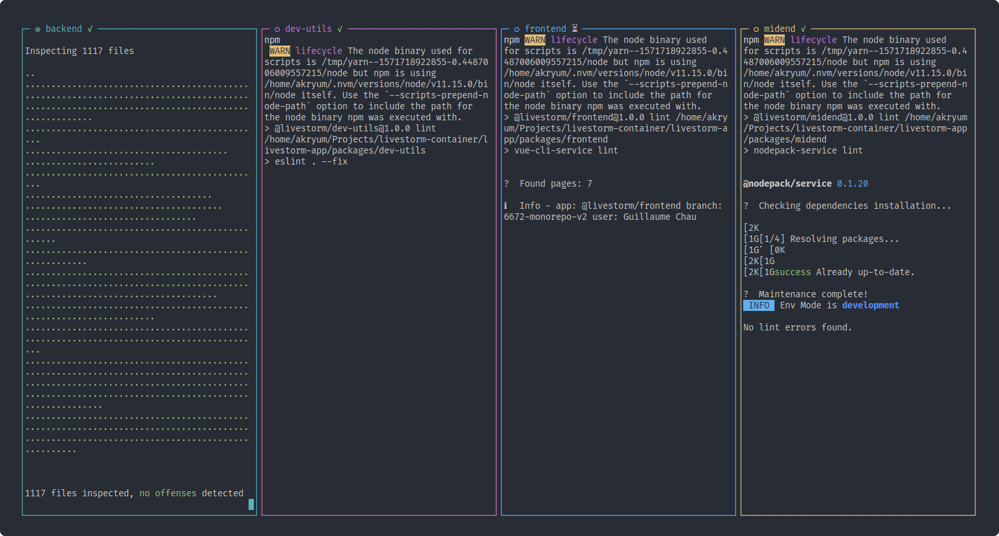

# monorepo-run
Run scripts in monorepo with colors, streaming and separated panes

<p align="center">
  
</p>

## Installation

```bash
yarn global add monorepo-run
```

Or locally in your project:

```bash
yarn add -D monorepo-run
```

## Usage

Execute `mono-run <script>` to run a NPM script in your monorepo packages.

By default it will understand Yarn workspaces.

To display the command help, use:

```bash
mono-run --help
```

### UI

Enable UI layouts with the `--ui` flag:

```bash
mono-run lint --ui row
```

<p align="center">
  
</p>

### Streaming

By default, `mono-run` will wait for scripts to complete before displaying the outputs. If you want to get the ouput as soon as it's written instead, specify the `--stream` flag:

```bash
mono-run dev --stream
```

You can throttle the output so it's less overwelming in case there are a lot of writes:

```bash
# Throttle every 500ms
mono-run dev --stream 500
```

## Examples

In your `package.json`:

```json
{
  "scripts": {
    "dev": "mono-run dev --stream 500",
    "lint": "mono-run lint",
    "test": "mono-run test"
  }
}
```
