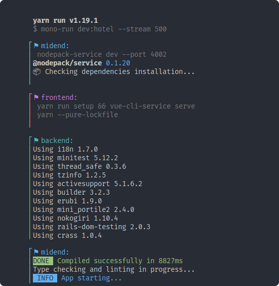

# monorepo-run
Run scripts in monorepo with colors and streaming support

<p align="center">
  
</p>

## Installation

```
yarn global add monorepo-run
```

Or locally in your project:

```
yarn add -D monorepo-run
```

## Usage

Execute `mono-run <script>` to run a NPM script in your monorepo packages.

By default it will understand Yarn workspaces.

To display the command help, use:

```
mono-run --help
```

## Examples

In your `package.json`:

```json
{
  "scripts": {
    "dev": "mono-run dev --stream 500",
    "lint": "mono-run lint",
    "test": "mono-run test"
  }
}
```
